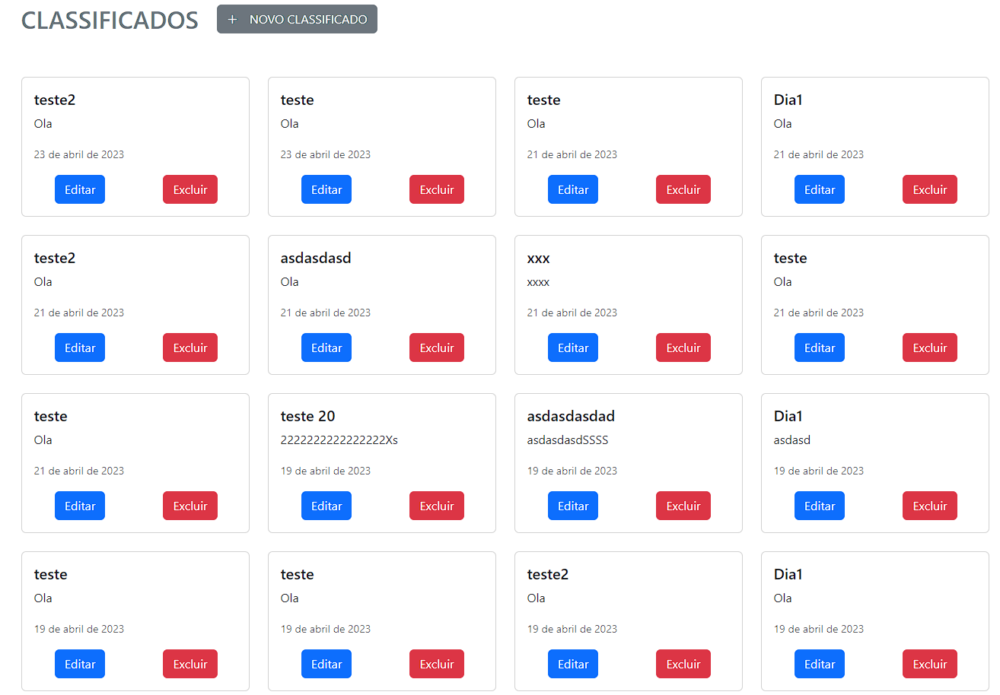
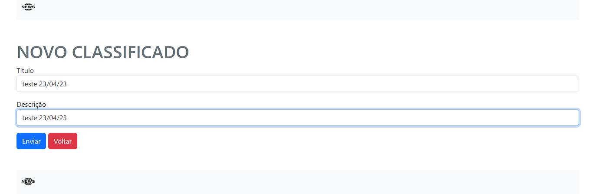
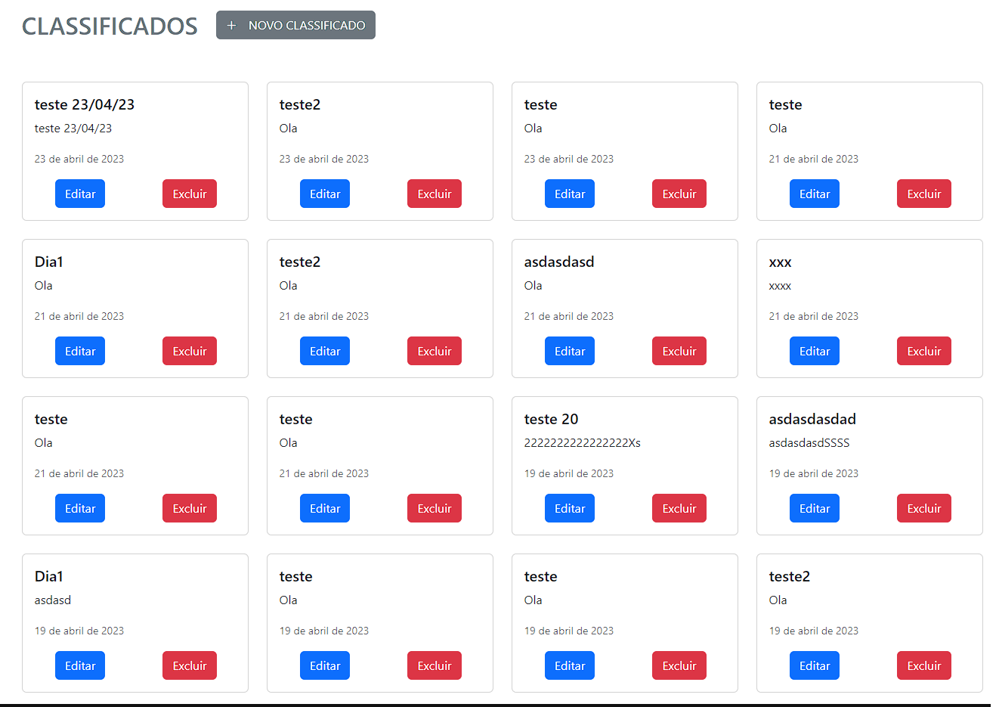
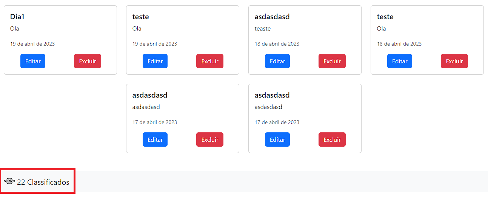

<h1>Classificados</h1>

Esse projeto é um desafio da empresa Spedy

 
<h2>Executando o teste</h2>

https://user-images.githubusercontent.com/114297585/233856140-26896907-6cfb-42d7-85ed-31866b997d69.mp4
<h2>Tela inicial</h2>
              
            
              
            <h2>Novo classificado</h2>
              
            
              
            <h2>Classificados em ordem mais recente</h2>
              
            
              
            <h2>Contagem dos Classificados</h2>
              
            
              
            <h2>Construido com:</h2>
            <h4>PHP e Bootstrap</h4>
